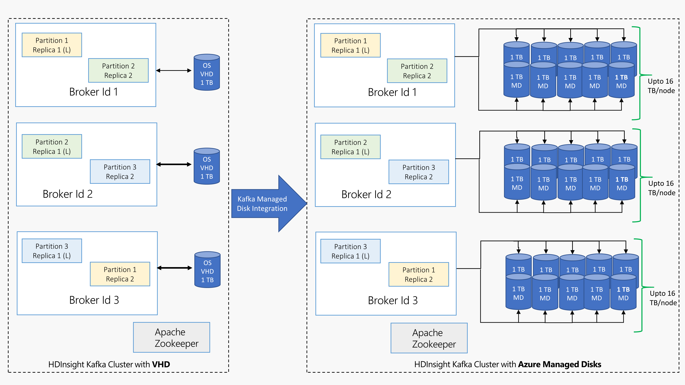
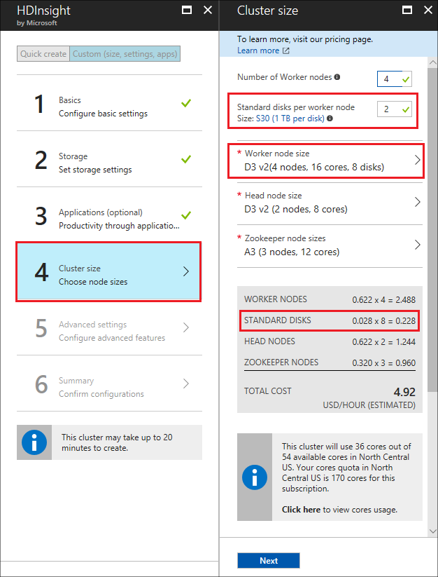

# Configure storage and scalability for Apache Kafka on HDInsight

Learn how to configure the number of managed disks used by Apache Kafka on HDInsight.

Kafka on HDInsight uses the local disk of the virtual machines in the HDInsight cluster. Since Kafka is very I/O heavy, [Azure Managed Disks](../virtual-machines/windows/managed-disks-overview.md) is used to provide high throughput and provide more storage per node. If traditional virtual hard drives (VHD) were used for Kafka, each node is limited to 1 TB. With managed disks, you can use multiple disks to achieve 16 TB for each node in the cluster.

The following diagram provides a comparison between Kafka on HDInsight before managed disks, and Kafka on HDInsight with managed disks:



## Configure managed disks: Azure portal

1. Follow the steps in the [Create an HDInsight cluster](hdinsight-hadoop-create-linux-clusters-portal.md) to understand the common steps to create a cluster using the portal. Do not complete the portal creation process.

2. From the __Cluster size__ section, use the __Disks per worker node__ field to configure the number of disks.

    > [!NOTE]
    > The type of managed disk can be either __Standard__ (HDD) or __Premium__ (SSD). Premium disks are used with DS and GS series VMs. All other VM types use standard.

    

## Configure managed disks: Resource Manager template

To control the number of disks used by the worker nodes in a Kafka cluster, use the following section of the template:

```json
"dataDisksGroups": [
    {
        "disksPerNode": "[variables('disksPerWorkerNode')]"
    }
    ],
```

You can find a complete template that demonstrates how to configure managed disks at [https://hditutorialdata.blob.core.windows.net/armtemplates/create-linux-based-kafka-mirror-cluster-in-vnet-v2.1.json](https://hditutorialdata.blob.core.windows.net/armtemplates/create-linux-based-kafka-mirror-cluster-in-vnet-v2.1.json).

## Next steps

For more information on working with Kafka on HDInsight, see the following documents:

* [Use MirrorMaker to create a replica of Kafka on HDInsight](hdinsight-apache-kafka-mirroring.md)
* [Use Apache Storm with Kafka on HDInsight](hdinsight-apache-storm-with-kafka.md)
* [Use Apache Spark with Kafka on HDInsight](hdinsight-apache-spark-with-kafka.md)
* [Connect to Kafka through an Azure Virtual Network](hdinsight-apache-kafka-connect-vpn-gateway.md)

* [HDInsight blog on managed disks with Kafka](https://azure.microsoft.com/blog/announcing-public-preview-of-apache-kafka-on-hdinsight-with-azure-managed-disks/)