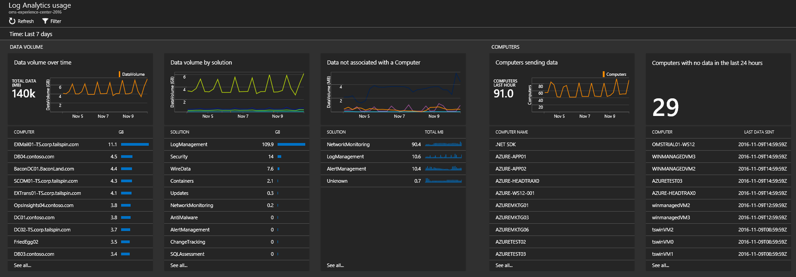
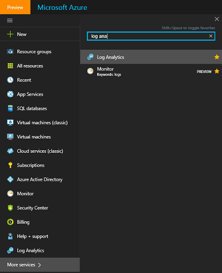
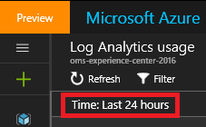
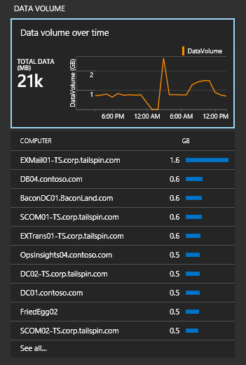
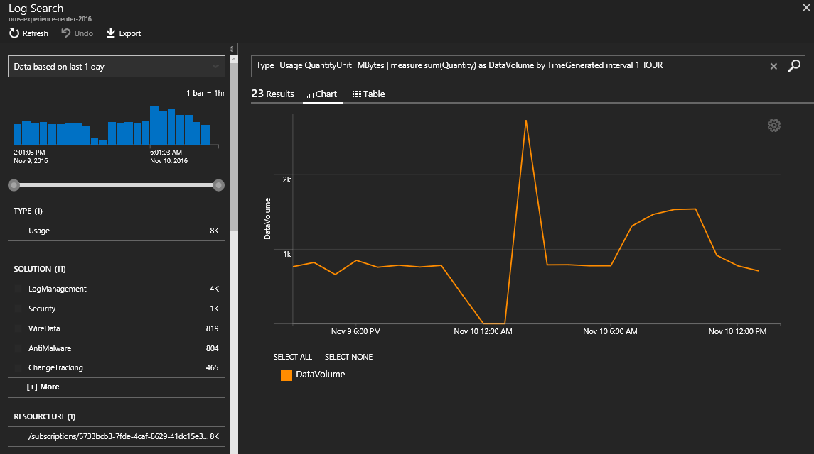
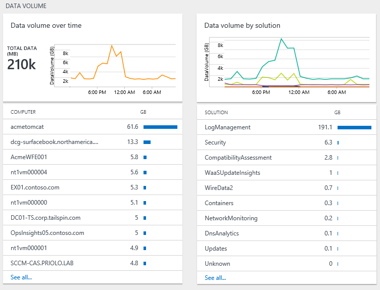
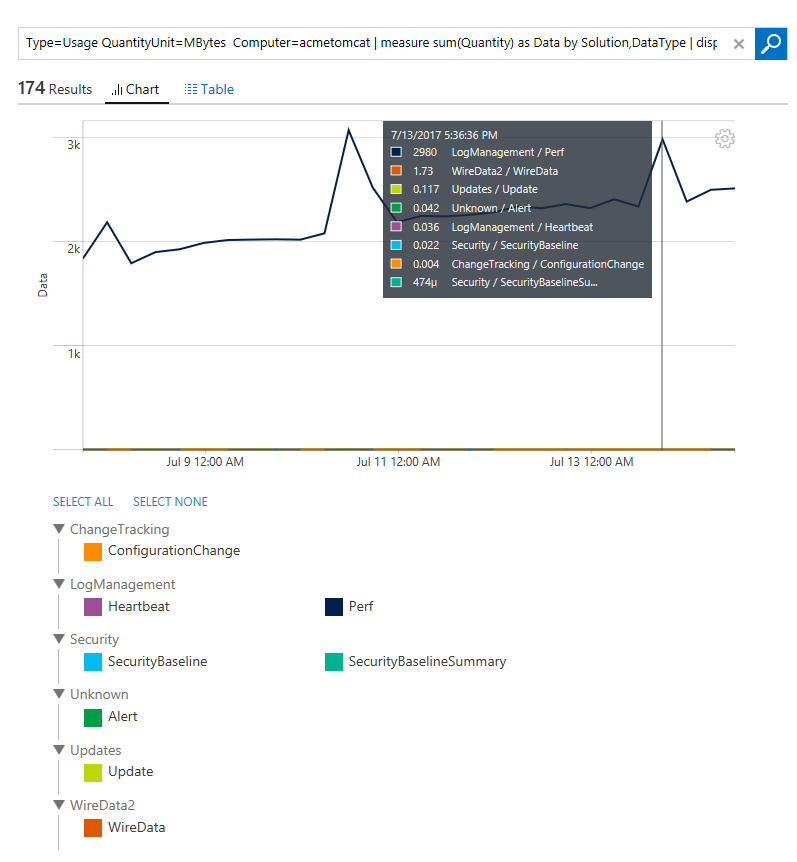
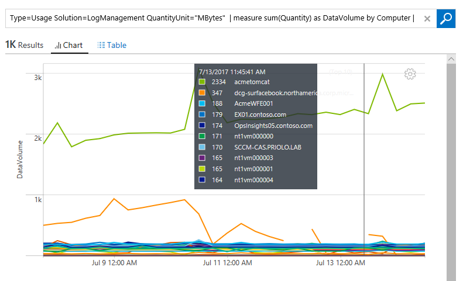
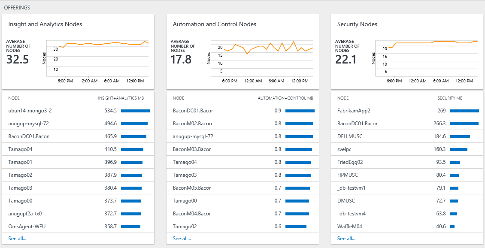

# Analyze data usage in Log Analytics
Log Analytics includes information on the amount of data collected, which computers sent the data and the different types of data sent.  Use the **Log Analytics Usage** dashboard to see the amount of data sent to the Log Analytics service. The dashboard shows how much data is collected by each solution and how much data your computers are sending.

## Understand the Usage dashboard
The **Log Analytics usage** dashboard displays the following information:

- Data volume
    - Data volume over time (based on your current time scope)
    - Data volume by solution
    - Data not associated with a computer
- Computers
    - Computers sending data
    - Computers with no data in last 24 hours
- Offerings
    - Insight and Analytics nodes
    - Automation and Control nodes
    - Security nodes
- Performance
    - Time taken to collect and index data
- List of queries

### To work with usage data
1. If you haven't already done so, sign in to the [Azure portal](https://portal.azure.com) using your Azure subscription.
2. On the **Hub** menu, click **More services** and in the list of resources, type **Log Analytics**. As you begin typing, the list filters based on your input. Click **Log Analytics**.  
    
3. The **Log Analytics** dashboard shows a list of your workspaces. Select a workspace.
4. In the *workspace* dashboard, click **Log Analytics usage**.
5. On the **Log Analytics Usage** dashboard, click **Time: Last 24 hours** to change the time interval.  
    
6. View the usage category blades that show areas you’re interested in. Choose a blade and then click an item in it to view more details in [Log Search](log-analytics-log-searches.md).  
    
7. On the Log Search dashboard, review the results that are returned from the search.  
    

## Create an alert when data collection is higher than expected
This section describes how to create an alert if:
- Data volume exceeds a specified amount.
- Data volume is predicted to exceed a specified amount.

Log Analytics [alerts](log-analytics-alerts-creating.md) use search queries. 
The following query has a result when there is more than 100 GB of data collected in the last 24 hours:

`Type=Usage QuantityUnit=MBytes IsBillable=true | measure sum(div(Quantity,1024)) as DataGB by Type | where DataGB > 100`

The following query uses a simple formula to predict when more than 100 GB of data will be sent in a day: 

`Type=Usage QuantityUnit=MBytes IsBillable=true | measure sum(div(mul(Quantity,8),1024)) as EstimatedGB by Type | where EstimatedGB > 100`

To alert on a different data volume, change the 100 in the queries to the number of GB you want to alert on.

Use the steps described in [create an alert rule](log-analytics-alerts-creating.md#create-an-alert-rule) to be notified when data collection is higher than expected.

When creating the alert for the first query -- when there is more than 100 GB of data in 24 hours, set the:
- **Name** to *Data volume greater than 100 GB in 24 hours*
- **Severity** to *Warning*
- **Search query** to `Type=Usage QuantityUnit=MBytes IsBillable=true | measure sum(div(Quantity,1024)) as DataGB by Type | where DataGB > 100`
- **Time window** to *24 Hours*.
- **Alert frequency** to be one hour since the usage data only updates once per hour.
- **Generate alert based on** to be *number of results*
- **Number of results** to be *Greater than 0*

Use the steps described in [add actions to alert rules](log-analytics-alerts-actions.md) configure an e-mail, webhook, or runbook action for the alert rule.

When creating the alert for the second query -- when it is predicted that there will be more than 100 GB of data in 24 hours, set the:
- **Name** to *Data volume expected to greater than 100 GB in 24 hours*
- **Severity** to *Warning*
- **Search query** to `Type=Usage QuantityUnit=MBytes IsBillable=true | measure sum(div(mul(Quantity,8),1024)) as EstimatedGB by Type | where EstimatedGB > 100`
- **Time window** to *3 Hours*.
- **Alert frequency** to be one hour since the usage data only updates once per hour.
- **Generate alert based on** to be *number of results*
- **Number of results** to be *Greater than 0*

When you receive an alert, use the steps in the following section to troubleshoot why usage is higher than expected.

## Troubleshooting why usage is higher than expected
The usage dashboard helps you to identify why usage (and therefore cost) is higher than you are expecting.

Higher usage is caused by one, or both of:
- More data than expected being sent to Log Analytics
- More nodes than expected sending data to Log Analytics

### Check if there is more data than expected 
There are two key sections of the usage page that help identify what is causing the most data to be collected.

The *Data volume over time* chart shows the total volume of data sent and the computers sending the most data. The chart at the top allows you to see if your overall data usage is growing, remaining steady or decreasing. The list of computers shows the 10 computers sending the most data.

The *Data volume by solution* chart shows the volume of data that is sent by each solution and the solutions sending the most data. The chart at the top shows the total volume of data that is sent by each solution over time. This information allows you to identify whether a solution is sending more data, about the same amount of data, or less data over time. The list of solutions shows the 10 solutions sending the most data. 

These two charts show all data. Some data is billable, and other data is free. To focus only on data that billable, modify the query on the search page to include `IsBillable=true`.  

Look at the *Data volume over time* chart. To see the solutions and data types that are sending the most data for a specific computer, click on the name of the computer. Click on the name of the first computer in the list.

In the following screenshot, the *Log Management / Perf* data type is sending the most data for the computer. 

Next, go back to the *Usage* dashboard and look at the *Data volume by solution* chart. To see the computers sending the most data for a solution, click on the name of the solution in the list. Click on the name of the first solution in the list. 

In the following screenshot, it confirms that the *acmetomcat* computer is sending the most data for the Log Management solution.

If needed, perform additional analysis to identify large volumes within a solution or data type. Example queries include:

+ **Security** solution
  - `Type=SecurityEvent | measure count() by EventID`
+ **Log Management** solution
  - `Type=Usage Solution=LogManagement IsBillable=true | measure count() by DataType`
+ **Perf** data type
  - `Type=Perf | measure count() by CounterPath`
  - `Type=Perf | measure count() by CounterName`
+ **Event** data type
  - `Type=Event | measure count() by EventID`
  - `Type=Event | measure count() by EventLog, EventLevelName`
+ **Syslog** data type
  - `Type=Syslog | measure count() by Facility, SeverityLevel`
  - `Type=Syslog | measure count() by ProcessName`
+ **AzureDiagnostics** data type
  - `Type=AzureDiagnostics | measure count() by ResourceProvider, ResourceId`

Use the following steps to reduce the volume of logs collected:

| Source of high data volume | How to reduce data volume |
| -------------------------- | ------------------------- |
| Security events            | Select [common or minimal security events](https://blogs.technet.microsoft.com/msoms/2016/11/08/filter-the-security-events-the-oms-security-collects/)   Change the security audit policy to collect only needed events. In particular, review the need to collect events for   - [audit filtering platform](https://technet.microsoft.com/library/dd772749(WS.10).aspx)   - [audit registry](https://docs.microsoft.com/windows/device-security/auditing/audit-registry)  - [audit file system](https://docs.microsoft.com/windows/device-security/auditing/audit-file-system)  - [audit kernel object](https://docs.microsoft.com/windows/device-security/auditing/audit-kernel-object)  - [audit handle manipulation](https://docs.microsoft.com/windows/device-security/auditing/audit-handle-manipulation)  - [audit removable storage](https://docs.microsoft.com/windows/device-security/auditing/audit-removable-storage) |
| Performance counters       | Change [performance counter configuration](log-analytics-data-sources-performance-counters.md) to:   - Reduce the frequency of collection   - Reduce number of performance counters |
| Event logs                 | Change [event log configuration](log-analytics-data-sources-windows-events.md) to:   - Reduce the number of event logs collected   - Collect only required event levels. For example, do not collect *Information* level events |
| Syslog                     | Change [syslog configuration](log-analytics-data-sources-syslog.md) to:   - Reduce the number of facilities collected   - Collect only required event levels. For example, do not collect *Info* and *Debug* level events |
| AzureDiagnostics           | Change resource log collection to:   - Reduce the number of resources send logs to Log Analytics   - Collect only required logs |
| Solution data from computers that don't need the solution | Use [solution targeting](../operations-management-suite/operations-management-suite-solution-targeting.md) to collect data from only required groups of computers. |

### Check if there are more nodes than expected
If you are on the *per node (OMS)* pricing tier, then you are charged based on the number of nodes and solutions you use. You can see how many nodes of each offer are being used in the *offerings* section of the usage dashboard.

Click on **See all...** to view the full list of computers sending data for the selected offer.

Use [solution targeting](../operations-management-suite/operations-management-suite-solution-targeting.md) to collect data from only required groups of computers.

## Next steps
* See [Log searches in Log Analytics](log-analytics-log-searches.md) to learn how to use the search language. You can use search queries to perform additional analysis on the usage data.
* Use the steps described in [create an alert rule](log-analytics-alerts-creating.md#create-an-alert-rule) to be notified when a search criteria is met
* Use [solution targeting](../operations-management-suite/operations-management-suite-solution-targeting.md) to collect data from only required groups of computers
* Select [common or minimal security events](https://blogs.technet.microsoft.com/msoms/2016/11/08/filter-the-security-events-the-oms-security-collects/)
* Change [performance counter configuration](log-analytics-data-sources-performance-counters.md)
* Change [event log configuration](log-analytics-data-sources-windows-events.md)
* Change [syslog configuration](log-analytics-data-sources-syslog.md)
